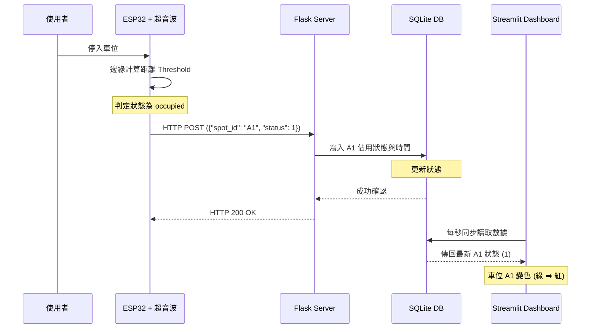

# 🚗 AIoT Project: 基於邊緣運算的微型智慧停車位即時監控系統 (Smart Parking System)

> 國立中興大學 資工系 AIoT 期中提案 - 第三組

## 📝 專案簡介 (Introduction)
為了解決都市停車痛點（如台北市車位自有率僅 55.6%、平均尋車時間達 11.3 分鐘），本專案提出一套結合**「邊緣輕量感測」**與**「政府開放大數據」**的雙軌制微型智慧停車監控系統。

相較於傳統地磁感測（單一車位建置成本 NT$ 5,000+）與高階影像辨識（NT$ 90,000+），本系統利用 ESP32 進行邊緣運算，將單一節點硬體成本壓縮至 **NT$ 300 以下**。我們提供了一套低成本、免破壞路面、且不受地下室黑暗環境影響的智慧停車升級方案。

## 🏗️ 系統架構 (System Architecture)
*(💡 註：我們已將系統運作序列圖整理如下)*



本系統採用標準物聯網三層式架構：
1. **邊緣感測層 (Edge Node):** ESP32 搭配 HC-SR04，在邊緣端計算距離閥值，判定車位狀態後才透過 Wi-Fi 發送輕量化 JSON 封包。
2. **後端與儲存層 (Backend & DB):** Python Flask 輕量級伺服器接收資料，並同步寫入 SQLite 關聯式資料庫，紀錄狀態與時間戳記。
3. **前端與大數據層 (Frontend & Macro-Data):** Streamlit 網頁框架即時輪詢資料庫，動態渲染戰情儀表板；未來計畫介接「政府資料開放平台」API 以整合宏觀數據。

## 🛠️ 技術棧與硬體規格 (Tech Stack & Hardware)
* **邊緣硬體:** NodeMCU-32S (ESP32), HC-SR04 超音波測距模組
* **後端開發:** Python 3, Flask, SQLite3
* **前端展示:** Streamlit, Pandas
* **通訊協定:** Wi-Fi (HTTP POST / GET)

## 📂 專案目錄結構 (Repository Structure)
```text
Smart-Parking-System/
├── README.md              # 專案說明書
├── src/                   # 核心程式碼 (Proof of Concept)
│   ├── sensor_node.ino    # ESP32 邊緣端 C++ 代碼
│   ├── app.py             # Flask 接收端與資料庫處理 API
│   └── dashboard.py       # Streamlit 前端儀表板渲染
└── docs/
    └── AIoT_Proposal_Group3.pdf # 期中提案簡報 (PDF 檔)
```

## 🚀 快速啟動 (Quick Start)

### 1. 邊緣硬體端 (ESP32)
請使用 Arduino IDE 開啟 `src/sensor_node.ino`。
修改程式碼中的 Wi-Fi `ssid` 與 `password`，並將 `serverName` 的 IP 地址更改為您執行 Flask 伺服器的區域網路 IP，最後燒錄至 ESP32。

### 2. 軟體端 (Server & Dashboard)
請確保您的電腦已安裝 Python 環境，並透過以下指令安裝所需套件：

```bash
pip install flask streamlit pandas
```

**步驟一：啟動 Flask 後端 API**
打開終端機，進入 `src` 目錄並執行：

```bash
cd src
python app.py
```
*(伺服器將於 http://0.0.0.0:5000 啟動並自動建立 parking.db 資料庫)*

**步驟二：啟動 Streamlit 儀表板**
開啟另一個新的終端機，同樣進入 `src` 目錄並執行：

```bash
cd src
streamlit run dashboard.py
```
*(瀏覽器將自動開啟即時監控面板，等待 ESP32 傳入數據)*

## 👥 團隊成員 (Team)
本專案為國立中興大學資工系 AIoT 課程期中提案。

**第三組成員:** 李亦騰 (4112056016) / 李欣員 / 朱奕諾
